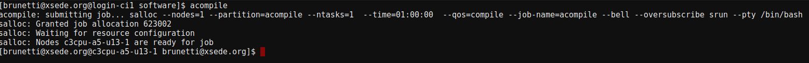
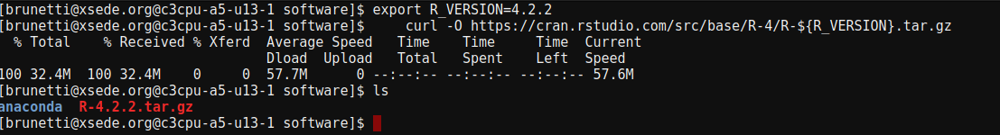
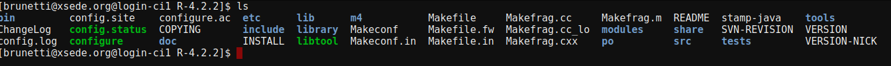
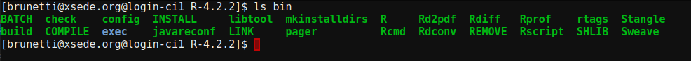
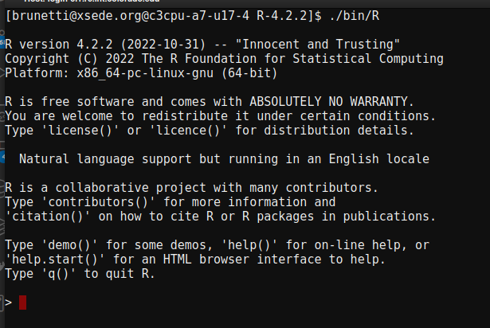
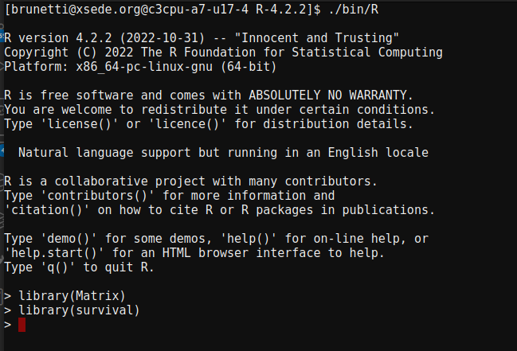
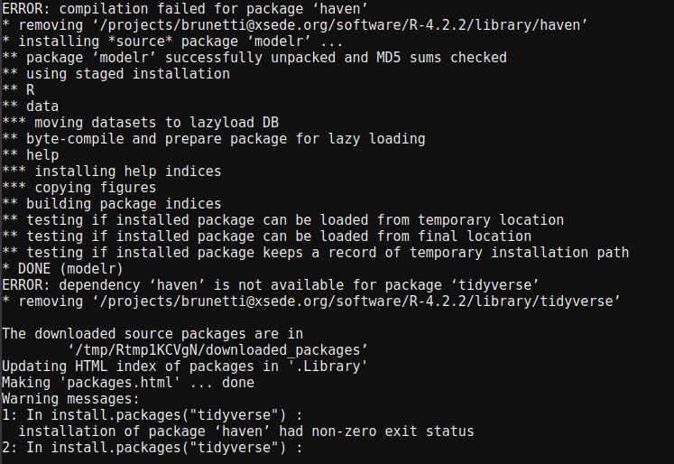
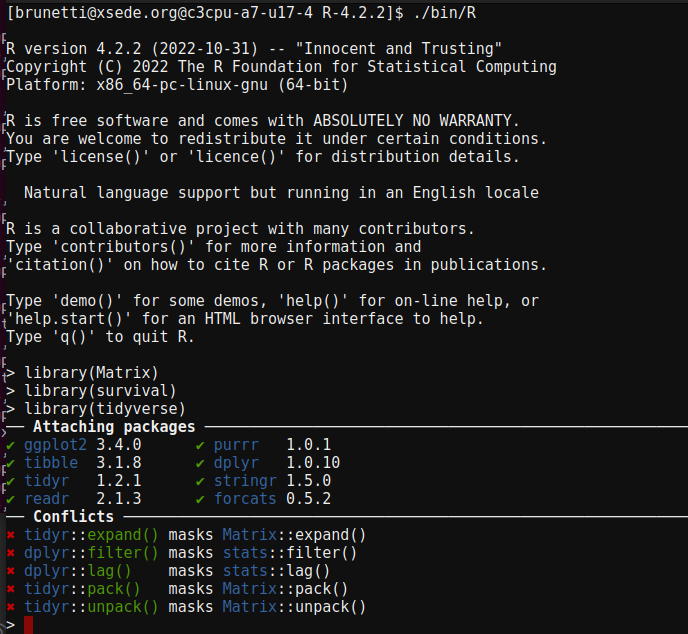
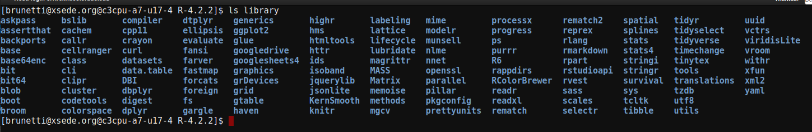

Install a local copy of R (recommended)
=======================================

Install R
^^^^^^^^^

1.  Request and start a compile node on Alpine  

.. code-block:: bash

    $ acompile  

2.  Navigate to your `/projects` directory for installation, as `$HOME` will be too small for the installation in addition to library installs.  You can create a new directory if you wish, as long it is within a subdirectory of your `/project` directory.    

.. code-block:: bash 

	$ cd /projects/yourUserName

3.  Run the following and make sure to list the exact version of R you want to install.  In this example, I want to install R version 4.2.2.  The following set of commands will download the version of R from `CRAN` and then unpack it in your directory.  

.. code-block:: bash  
    
    module load jdk/1.8.0
    export R_VERSION=4.2.2
    curl -O https://cran.rstudio.com/src/base/R-4/R-${R_VERSION}.tar.gz
    tar -xzvf R-${R_VERSION}.tar.gz
    cd R-${R_VERSION}

4.  Configure R by running the following.  Be sure to change the `--prefix` argument to where you want R to install in your `/projects` directory. In this example, I giving it the path to where my R diectory is located. 

.. code-block:: bash  

    ./configure --prefix=/projects/yourUserName/${R_VERSION} --enable-R-shlib --enable-memory-profiling

5.  Finally, we can build `R` by calling the make command.  

.. code-block:: bash  

    make

Testing your local R installation
^^^^^^^^^^^^^^^^^^^^^^^^^^^^^^^^^
Now that you have installed R, you should test it to make sure it works.  

Notice that if you run the `ls` command you should now see several new directories.  The two that are of importance are:  
 
*  `library`  
*  `bin` 

1.  To see what libraries you have installed for this version of `R`, you can run the following command within your `--prefix` specified directory:  

.. code-block:: bash  

    ls library

This will show you all the libraries you currently have installed.  

2.  To start your R session, you need to run your R executable which is located in the `bin` directory.  To see where this is, again, change directores to where you installed `R` when you specified the `--prefix` command and run the following:  

.. code-block:: bash  

    ls bin

You are looking for the `R` executable:  

3.  Now let's spawn off our R session by specifying the path to that executable within our installation directory:  

.. code-block:: bash  

    ./bin/R

You are now in an R session!

4.  Notice when we looked inside our `library` directory, we already had some libraries listed.  To check that these work, let's pick a library to load into our R session.  For this example, I am going to load in the `Matrix` and `survival` packages into my running R session.  

.. code-block:: R

    library(Matrix)
    library(survial)

You will notice they load fine and now we can confirm your libraries and R session are properly installed and running.  

Install R packages
^^^^^^^^^^^^^^^^^^
The installation of R packages should not be any different than when you run R locally.  

1.  Request and start a compile node on Alpine  

.. code-block:: bash

    $ acompile  

2.  Spawn off your R session:  

.. code-block:: bash

    ./bin/R

3.  Let's try to load in a packages we don't have install yet, such as `tidyverse`. 

.. code-block:: R

    library(tidyverse)

.. warning::
    Oops!  You will see an error what it is not installed.

4.  You can use the `install.packages()` function to install `tidyverse` as follows:  

.. code-block:: R

    install.packages("tidyverse")

You will see a long thread of log lines and commands that is running.  Let it run until the command prompt is returned.

5.  You will notice, that for `tidyverse` the install failed because it has an R dependency called `haven`.  

Therefore, follow the recommendation to install `haven`:

.. code-block:: R

    install.packages("haven")

You should see it successfully installed, and now you can try to install `tidyverse` again:

.. code-block:: R

    install.packages("tidyverse")

Hopefully that succcessfully installs `tidyverse`.  

6.  You can check that `tidyverse` and its dependencies were sucessfully installed by loading the library into your `R` session:

.. code-block:: R

    library(tidyverse)

**AND**

you can check that `tidyverse` is in your `library` directory like we saw previously after exiting the `R`` session and lising out the libraries in the `library`` directory.  

.. code-block:: bash

    ls library

Placing R in your path
^^^^^^^^^^^^^^^^^^^^^^
**Tired of having to specify the full path to your `bin/R` executable location?**  YOu can place R in your path or specify the path temporarily (if you have multiple versions of R)

Temporarily specify R
----------------------

.. note::
    By using the temporary method listed here, you will always need to call the same `export` command call everytime you start a new shell session or want to use R in a batch script.  
    
		
Instead of always calling `R` by using its full path (`/projects/yourUserName/R-4.2.2/bin/R`, or where ever the `bin/R` is located from your install), you can run the following command on your session and this will call `R` directly for the life of your session. i.e when you log out or spawn a new session or new job script you will need to run/add this command each time.  This is useful, if you want to maintain multiple versions of R and R libraries in your environment:  

.. code-block:: bash

    export PATH=/projects/yourUserName/R-4.2.2/bin/:$PATH

Now, anywhere you navigate within the current session, you will be able to start R, just by typing:  

.. code-block:: R
    R

Or if have a batch script, you can add that line to any batch script before your program calls `R`.  For example:

.. code-block:: bash

    #SBATCH --nodes=1
    #SBATCH --partition=amilan
    #SBATCH --account=amc-general
    #SBATCH --time=01:00:00
    #SBATCH --memory=10G
    #SBATCH --log=myOutput%J.log
    #SBATCH --eror=myOutput%J.err
    
    export PATH=/projects/yourUserName/R-4.2.2/bin/:$PATH

    Rscript myRscript.R

Permanently specify R
----------------------
If you only want to maintain a single version of R, you can add the command above to your `.bashrc `profile.  Your `.bashrc` profile is always located as a hidden file underneath your $HOME directory at `~/.bashrc`.  

1.  Open your `~/.bashrc`` and add the following, making sure to update the `/projects/yourUserName/R-4.2.2/bin/` to match the location where your `bin` folder is located for your R install.  

.. code-block:: bash

    export PATH=/projects/yourUserName/R-4.2.2/bin/:$PATH

2.  Save the file after updating.

3.  Either log out of your current session and log back in **OR** type `source ~/.bashrc` in your current session to make sure the changes take effect.  

4.  Now when you type `R` any where on the command line or submit a batch job, it will automatically know where your `R` installation is without having to specify the full path.   